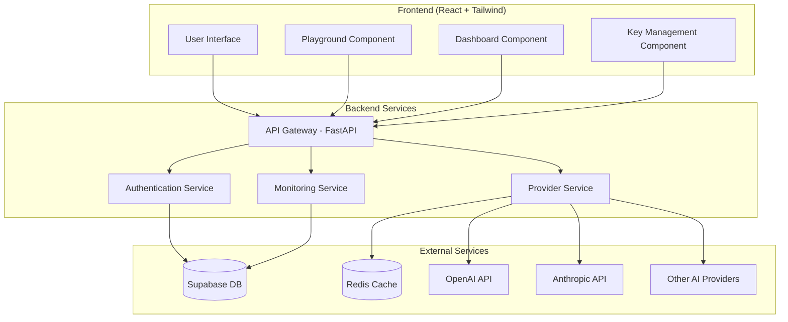

# Design Document

## Overview

StrataAI is designed as a microservices-based platform with a clear separation between frontend and backend components. The architecture leverages modern cloud-native patterns with FastAPI for the backend API gateway, React for the frontend, Supabase for data persistence and authentication, and Redis for caching and rate limiting. The system uses LangChain's provider abstractions to create a unified interface across multiple AI providers.

## Architecture

### High-Level Architecture



### Directory Structure

```
strata-ai/
├── frontend/
│   ├── src/
│   │   ├── components/
│   │   ├── pages/
│   │   ├── hooks/
│   │   ├── services/
│   │   └── utils/
│   ├── public/
│   └── package.json
├── backend/
│   ├── app/
│   │   ├── api/
│   │   ├── core/
│   │   ├── models/
│   │   ├── services/
│   │   └── utils/
│   ├── tests/
│   └── requirements.txt
├── docker-compose.yml
└── README.md
```

## Components and Interfaces

### Backend Components

#### 1. API Gateway (FastAPI)

- **Purpose**: Central entry point for all API requests
- **Responsibilities**:
  - Request routing and validation
  - Authentication middleware
  - Rate limiting enforcement
  - Request/response logging
- **Key Endpoints**:
  - `/auth/*` - Authentication endpoints
  - `/api/keys/*` - API key management
  - `/api/chat/*` - Unified chat completions
  - `/api/usage/*` - Usage analytics
  - `/api/playground/*` - Playground functionality

#### 2. Authentication Service

- **Purpose**: Handle user authentication and authorization
- **Integration**: Supabase Auth with JWT tokens
- **Features**:
  - User registration/login
  - JWT token validation
  - Session management
  - Row-level security enforcement

#### 3. Provider Service

- **Purpose**: Abstract AI provider interactions using LangChain
- **Responsibilities**:
  - Provider routing based on model selection
  - API key retrieval and validation
  - Request transformation and response normalization
  - Error handling and retry logic
- **Supported Providers**:
  - OpenAI (GPT models)
  - Anthropic (Claude models)
  - Extensible for additional providers

#### 4. Monitoring Service

- **Purpose**: Track usage, calculate costs, and provide analytics
- **Features**:
  - Real-time usage logging
  - Cost calculation based on provider pricing
  - Usage aggregation and reporting
  - Alert system for usage thresholds

### Frontend Components

#### 1. Authentication Components

- Login/Register forms
- Protected route wrapper
- User profile management

#### 2. API Key Management

- Key addition/editing interface
- Masked key display
- Provider validation status

#### 3. Playground Interface

- Model/provider selection dropdown
- Request composition form
- Response display with syntax highlighting
- Request history and replay functionality

#### 4. Dashboard Components

- Usage charts and metrics
- Cost analysis visualizations
- Time-based filtering
- Provider comparison views

## Data Models

### User Model

```typescript
interface User {
  id: string;
  email: string;
  created_at: timestamp;
  updated_at: timestamp;
}
```

### API Key Model

```typescript
interface APIKey {
  id: string;
  user_id: string;
  provider: "openai" | "anthropic" | "other";
  key_name: string;
  encrypted_key: string;
  is_active: boolean;
  created_at: timestamp;
  last_validated: timestamp;
}
```

### Usage Log Model

```typescript
interface UsageLog {
  id: string;
  user_id: string;
  provider: string;
  model: string;
  request_tokens: number;
  response_tokens: number;
  total_tokens: number;
  cost_usd: number;
  response_time_ms: number;
  status: "success" | "error";
  error_message?: string;
  created_at: timestamp;
}
```

### Request History Model

```typescript
interface RequestHistory {
  id: string;
  user_id: string;
  provider: string;
  model: string;
  request_payload: json;
  response_payload: json;
  created_at: timestamp;
}
```

## Error Handling

### Error Categories

1. **Authentication Errors** (401, 403)
2. **Validation Errors** (400)
3. **Provider Errors** (502, 503, 504)
4. **Rate Limiting Errors** (429)
5. **Internal Server Errors** (500)

### Error Response Format

```typescript
interface ErrorResponse {
  error: {
    code: string;
    message: string;
    details?: any;
    timestamp: string;
  };
}
```

### Error Handling Strategy

- **Frontend**: Global error boundary with user-friendly messages
- **Backend**: Structured error responses with appropriate HTTP status codes
- **Logging**: Comprehensive error logging for debugging and monitoring
- **Retry Logic**: Exponential backoff for transient provider errors

## Testing Strategy

### Backend Testing

1. **Unit Tests**

   - Service layer logic
   - Data model validation
   - Utility functions
   - Target: 90% code coverage

2. **Integration Tests**

   - API endpoint testing
   - Database operations
   - Provider integrations (mocked)
   - Authentication flows

3. **End-to-End Tests**
   - Complete user workflows
   - Cross-service communication
   - Error scenarios

### Frontend Testing

1. **Component Tests**

   - React component rendering
   - User interaction handling
   - Props and state management

2. **Integration Tests**

   - API service integration
   - Route navigation
   - Authentication flows

3. **E2E Tests**
   - Critical user journeys
   - Cross-browser compatibility
   - Responsive design validation

### Testing Tools

- **Backend**: pytest, FastAPI TestClient, factory_boy
- **Frontend**: Jest, React Testing Library, Cypress
- **API Testing**: Postman/Newman for API contract testing
- **Load Testing**: Locust for performance testing

## Security Considerations

### Data Protection

- API keys encrypted using AES-256 encryption
- Sensitive data excluded from logs
- HTTPS enforcement for all communications
- Input validation and sanitization

### Authentication & Authorization

- JWT tokens with appropriate expiration
- Row-level security in Supabase
- API rate limiting per user
- CORS configuration for frontend access

### Infrastructure Security

- Environment variable management for secrets
- Database connection encryption
- Redis AUTH for cache access
- Container security best practices

## Performance Optimization

### Caching Strategy

- **Redis Caching**:
  - API response caching (configurable TTL)
  - User session caching
  - Rate limiting counters
  - Provider model metadata

### Database Optimization

- Proper indexing on frequently queried fields
- Connection pooling for database access
- Query optimization for analytics endpoints
- Pagination for large result sets

### Frontend Optimization

- Code splitting and lazy loading
- Memoization for expensive computations
- Debounced API calls for search/filter
- Optimistic UI updates where appropriate
